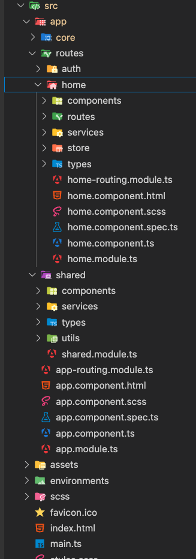
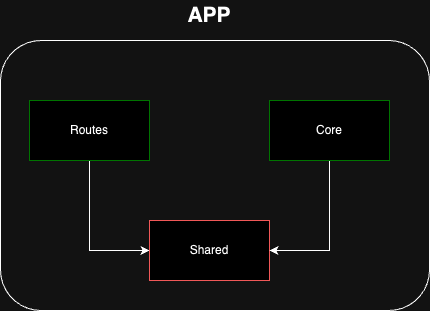
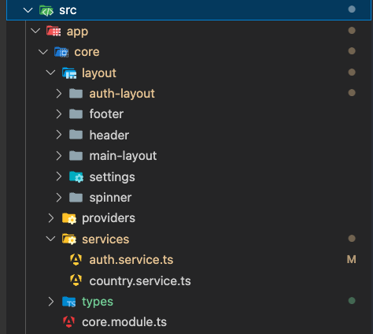
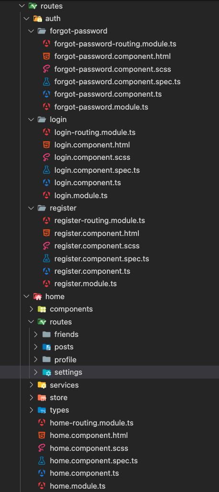
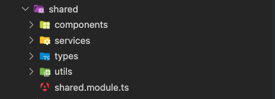
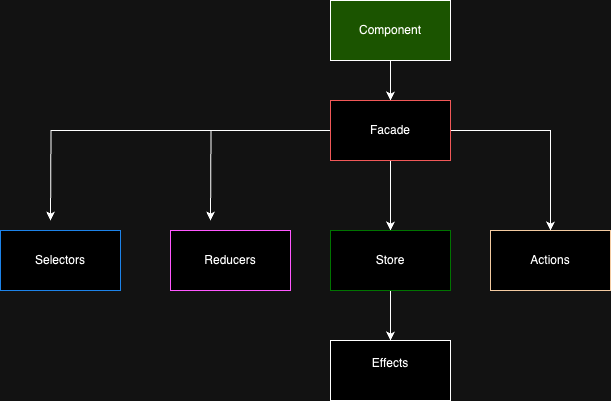

# Architecture

## Project structure

The project follows the next principle LIFT
- Locate: Group coherently
- Identify: Name to indicate the content
- Flat: Create subfolders if necessary
- Try-DRY: Some redundancy can be beneficial

### File naming convetion
Compose the name from functional and technical nature `functional.technical.ts`

For example : `profile-detail.component.html` , `current-user.interface.ts`

### Folder Structure
Group files in folders
In order to add new functionalities follow the next:

- Things used by the root. It typically includes the layout of the application and many injectable services provided at the root. We called it the core module.
- The functionalities that are assigned to routes. For each one, it’s lazy load and its module with its routes.
- Things used on feature pages. Here, we used to find silly components, directives, and presentation pipes. no surprise this time, the name chosen was shared.
- Being the module the unit of compiled result, some people tend to create modules just for the sake of having smaller .js chunks.

```
- /core (services to be used from the root)
- /routes (the functional branches of the navigation tree)
- /shared (utilities to be used from functional branches)
```
> [!NOTE]
> Grouping files
> - A folder with less than 5 elements does not need to be subdivided
> - A folder with more than 15 elements must be subdivided
> - Folders between 6 and 14 items are divided if an obvious criterion arises



## Modules




### Core
This folder will be home to things you’ll use once in the lifetime of the application. Things we used to call singletons were provided at the root as injectable services.
Example: `spinner.service.ts`

>[!Note]
>Use a core folder for providers and configurations used across the entire application. Consider adding features not related to routes like a header, footer, dialogs and any layout components.




### Routes

 Routes are navigation trees
 Keep related routes in the same folder for example
 `home/routes/settings`

>[!Note]
>Inside each route try to group the necesities for the module like services, store, components.



### Shared

All things not related to a specific feature or not provided as services at the application level have a place here. 

> [!Note]
> Divide the shared folder using this technical criterion that will be more helpful



## Project Patterns

### NgRx

Store is RxJS powered global state management for Angular applications, inspired by Redux. Store is a controlled state container designed to help write performant, consistent applications on top of Angular.

NgRx Store is mainly for managing global state across an entire application.


### NgRx and Facade Pattern

The NgRx Facade Pattern is an architectural design pattern that introduces an additional layer (the facade) between the Angular components and the NgRx store.

The facade itself is a service that encapsulates the NgRx store logic, exposing only the necessary functionalities to the components. 



